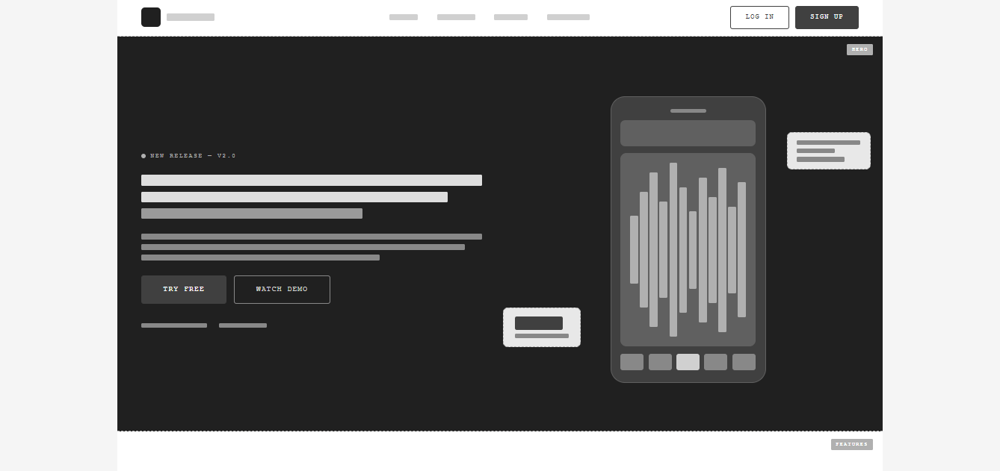

# Wireframe — Music App Landing Page

Wireframe de alta fidelidad en escala de grises para una landing page de app de música, generado como un solo archivo HTML con CSS embebido.

---
## Vistas


---

## Estructura de secciones

| # | Sección | Descripción |
|---|---------|-------------|
| 1 | **Navbar** | Logo + links de navegación centrados + acciones (Log in / Sign up) |
| 2 | **Hero** | Headline + subtítulo + CTAs + mockup de teléfono con waveform |
| 3 | **Features** | Grid 3×2 de tarjetas de funcionalidades con ícono, título y descripción |
| 4 | **Testimonials** | Grid 3×1 de tarjetas con estrellas, cita y datos del autor |
| 5 | **CTA** | Formulario de email + badges de App Store / Google Play + pantalla de app |
| 6 | **Footer** | Brand + 3 columnas de links + barra legal |

---

## Decisiones de diseño

- **Paleta**: 10 tonos de gris (`--c0` blanco → `--c9` casi negro), sin ningún color.
- **Tipografía**: `Courier New` — fuente monoespaciada que refuerza la estética de wireframe tipo Figma.
- **Bordes**: `1.5px dashed` en gris medio para diferenciar placeholders de contenido real.
- **Anotaciones**: chips flotantes en cada sección indican su nombre (`Navbar`, `Hero`, etc.).
- **Jerarquía visual**: fondos alternados (`--c0`, `--c1`, `--c8`) distinguen claramente las secciones.
- **Placeholders**: bloques `div` con altura, ancho y radio de borde representan texto, imágenes e iconos sin contenido real.
- **Grid layout**: CSS Grid en navbar (3 cols), hero/CTA (2 cols), features/testimonials (3 cols) y footer (4 cols).

---

## Uso

Abrir `wlanding.html` directamente en cualquier navegador moderno. No requiere dependencias externas, servidor ni build step.

```bash
open wlanding.html        # macOS
start wlanding.html       # Windows
xdg-open wlanding.html    # Linux
```

---

## Estructura de archivos

```
/
├── wlanding.html    # Wireframe completo (HTML + CSS embebido)
└── README.md     # Este archivo
```

---

## Próximos pasos sugeridos

1. Reemplazar placeholders de texto con copy real.
2. Sustituir bloques grises por imágenes y activos de marca.
3. Aplicar paleta de color definitiva usando las variables CSS (`--c0`…`--c9`).
4. Convertir a componentes React/Vue para integración con el stack de producción.
